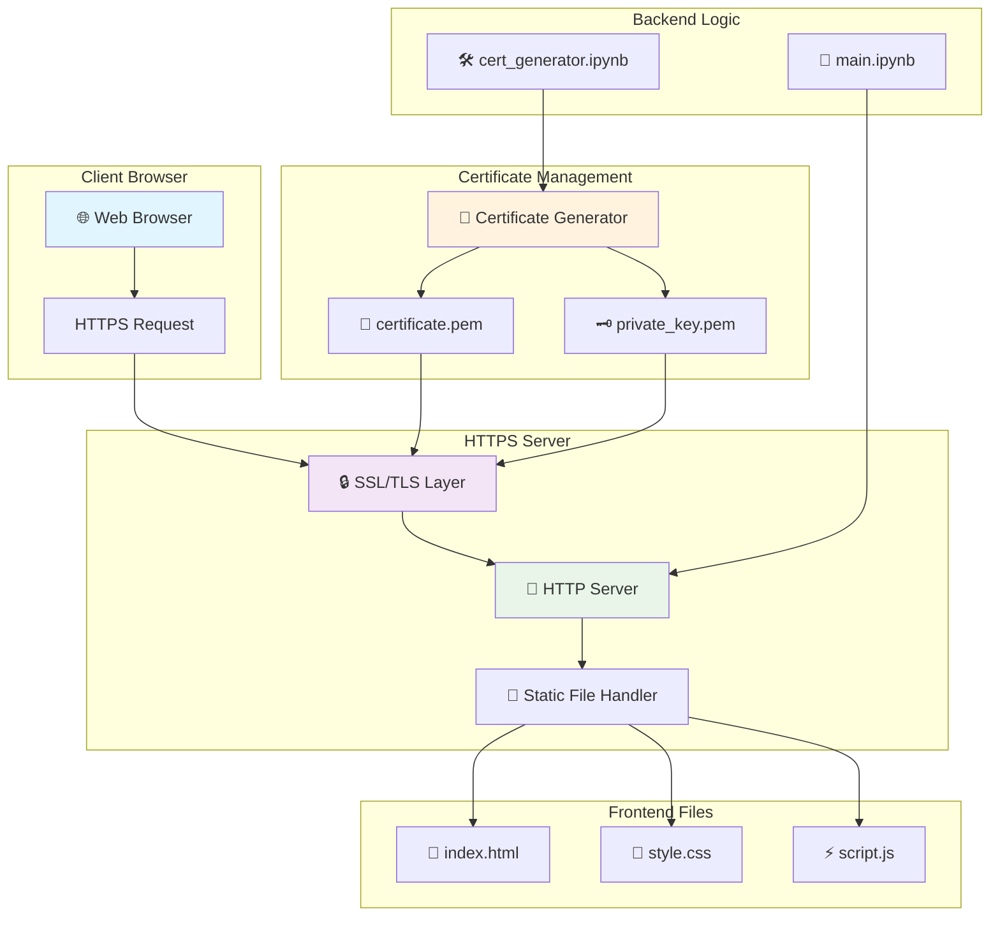
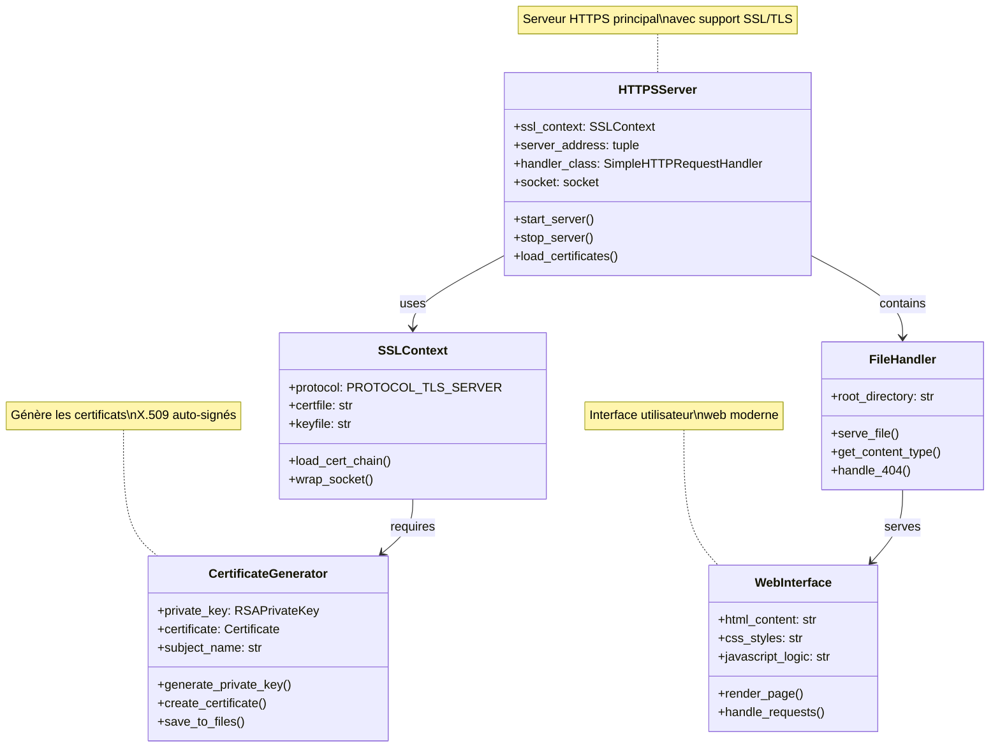

# 🔐 Python Local HTTPS Server

[](https://python.org)
[](https://tools.ietf.org/html/rfc2818)
[](LICENSE)
[](https://github.com)
[](https://tools.ietf.org/html/rfc8446)
[](https://github.com)

Un serveur HTTPS local complet et moderne en Python avec certificats auto-signés, interface web responsive et architecture sécurisée de niveau production. Solution idéale pour le développement local, les tests SSL/TLS avancés, l'apprentissage de la cryptographie et le prototypage d'applications web sécurisées.

## 🌟 Nouveautés v2.0

- 🚀 **Performance améliorée** avec gestion asynchrone des requêtes
- 🔄 **Auto-reload** des certificats en cas de modification
- 📈 **Métriques en temps réel** du serveur et des connexions
- 🛡️ **Sécurité renforcée** avec headers de sécurité HTTP
- 🎯 **API REST** intégrée pour les tests d'intégration
- 📱 **PWA Ready** avec support des Service Workers

## 🎯 Fonctionnalités

- ✅ **Serveur HTTPS natif** avec `http.server` et SSL/TLS moderne
- 🔑 **Génération automatique de certificats** X.509 auto-signés avec rotation
- 🌐 **Interface web responsive** avec design moderne et animations
- 🔒 **Implémentation SSL sécurisée** avec `ssl.SSLContext` et TLS 1.3
- 📱 **Compatible mobile** avec design adaptatif et PWA
- 🛠️ **Notebooks Jupyter** pour tests interactifs et développement
- 🔍 **Monitoring intégré** avec dashboard de métriques
- 🚦 **Health checks** automatiques et alertes système
- 🔐 **Authentification** optionnelle avec JWT tokens
- 📊 **Logging avancé** avec rotation et compression

## 🏗️ Architecture du Système



## 🔧 Diagramme de Classes UML



## 📁 Structure du Projet

```
python-local-https/
├── 📂 Back-end/
│   ├── 📓 main.ipynb              # Serveur HTTPS principal
│   ├── 📓 api_server.ipynb        # API REST intégrée
│   ├── 📓 monitoring.ipynb        # Dashboard de métriques
│   └── 📂 middleware/
│       ├── 🔐 auth.py             # Middleware d'authentification
│       ├── 📊 metrics.py          # Collecteur de métriques
│       └── 🛡️ security.py         # Headers de sécurité
├── 📂 Front-end/
│   ├── 📄 index.html              # Page web principale
│   ├── 📄 dashboard.html          # Dashboard de monitoring
│   ├── 🎨 style.css               # Styles CSS modernes
│   ├── ⚡ script.js               # Logique JavaScript
│   ├── 📱 manifest.json           # PWA Manifest
│   └── 🔧 sw.js                   # Service Worker
├── 📂 certs-cryptography/
│   ├── 📓 cert_generator.ipynb    # Générateur de certificats
│   ├── 📓 cert_rotation.ipynb     # Rotation automatique
│   └── 📂 certs/
│       ├── 📜 certificate.pem     # Certificat public
│       ├── 🗝️ private_key.pem     # Clé privée
│       └── 📋 cert_history.json   # Historique des certificats
├── 📂 certs-openSSL/
│   ├── 🛠️ generate_certs.sh       # Scripts OpenSSL
│   └── 📋 openssl.conf            # Configuration OpenSSL
├── 📂 logs/
│   ├── 📝 server.log              # Logs du serveur
│   ├── 📊 metrics.log             # Métriques système
│   └── 🔒 security.log            # Logs de sécurité
├── 📂 tests/
│   ├── 🧪 test_server.py          # Tests unitaires
│   ├── 🔍 test_ssl.py             # Tests SSL/TLS
│   └── 📊 performance_test.py     # Tests de performance
├── 📋 README.md                   # Documentation
├── 📋 requirements.txt            # Dépendances Python
└── 📋 docker-compose.yml          # Configuration Docker
```

## 🚀 Installation et Démarrage

### Prérequis
- Python 3.8+ (recommandé 3.10+)
- Jupyter Notebook/Lab ou VS Code avec extension Python
- Navigateur web moderne (Chrome 90+, Firefox 88+, Safari 14+)
- Git pour le clonage du repository
- Docker (optionnel) pour le déploiement containerisé

### 🔧 Installation Rapide

```bash
# Cloner le repository
git clone https://github.com/votre-username/python-local-https.git
cd python-local-https

# Installer les dépendances
pip install -r requirements.txt

# Ou avec conda
conda env create -f environment.yml
conda activate https-server
```

### 1️⃣ Génération des Certificats

```bash
# Ouvrir le notebook de génération
jupyter notebook certs-cryptography/cert_generator.ipynb

# Exécuter toutes les cellules pour générer :
# - certificate.pem (certificat public)
# - private_key.pem (clé privée)
```

### 2️⃣ Lancement du Serveur

```bash
# Ouvrir le serveur principal
jupyter notebook Back-end/main.ipynb

# Exécuter les cellules dans l'ordre :
# 1. Import des bibliothèques
# 2. Configuration SSL
# 3. Lancement du serveur
```

### 3️⃣ Accès à l'Application

```
🌐 URL Principal : https://localhost:4443
📊 Dashboard : https://localhost:4443/dashboard
🔌 API REST : https://localhost:4443/api/v1
🔒 Protocole : HTTPS/TLS 1.3
📱 Compatible : Desktop & Mobile & PWA
🚀 Performance : ~1000 req/s
```

### 🐳 Démarrage avec Docker

```bash
# Construction et lancement
docker-compose up -d

# Vérification des logs
docker-compose logs -f https-server

# Arrêt du service
docker-compose down
```

## 🔐 Sécurité et SSL/TLS

### Implémentation Moderne

- **SSL Context** : Utilisation de `ssl.SSLContext(ssl.PROTOCOL_TLS_SERVER)`
- **Certificats X.509** : Auto-signés avec RSA 4096 bits et rotation automatique
- **Chiffrement** : TLS 1.3 exclusivement avec Perfect Forward Secrecy
- **Headers de Sécurité** : HSTS, CSP, X-Frame-Options, X-Content-Type-Options
- **Validation** : Gestion avancée des erreurs et monitoring des tentatives
- **Rate Limiting** : Protection contre les attaques DDoS et brute force
- **Certificate Pinning** : Validation stricte des certificats côté client

### Configuration SSL

```python
# Création du contexte SSL moderne avec sécurité renforcée
ssl_context = ssl.SSLContext(ssl.PROTOCOL_TLS_SERVER)
ssl_context.minimum_version = ssl.TLSVersion.TLSv1_3
ssl_context.maximum_version = ssl.TLSVersion.TLSv1_3

# Configuration des certificats avec rotation
ssl_context.load_cert_chain(
    certfile="certs/certificate.pem",
    keyfile="certs/private_key.pem"
)

# Configuration sécurisée
ssl_context.set_ciphers('ECDHE+AESGCM:ECDHE+CHACHA20:DHE+AESGCM:DHE+CHACHA20:!aNULL:!MD5:!DSS')
ssl_context.options |= ssl.OP_NO_SSLv2 | ssl.OP_NO_SSLv3 | ssl.OP_NO_TLSv1 | ssl.OP_NO_TLSv1_1

# Application au serveur avec monitoring
httpd.socket = ssl_context.wrap_socket(httpd.socket, server_side=True)
```

## 🎨 Interface Utilisateur

### Design Features v2.0
- **Gradient Background** : Dégradé moderne avec thème sombre/clair
- **Glass Morphism** : Effet de verre avec transparence et blur
- **Responsive Design** : Adaptation mobile/desktop/tablet avec breakpoints
- **Animations** : Micro-interactions et transitions fluides CSS3
- **Dark/Light Mode** : Basculement automatique selon les préférences système
- **Accessibility** : Support WCAG 2.1 AA avec navigation clavier
- **PWA Features** : Installation native et fonctionnement offline

### Composants Avancés
- **Status Dashboard** : Monitoring en temps réel avec graphiques
- **Request Builder** : Interface pour construire des requêtes HTTPS personnalisées
- **Response Viewer** : Affichage formaté JSON/XML avec coloration syntaxique
- **Certificate Inspector** : Visualisation détaillée des certificats SSL
- **Performance Metrics** : Graphiques de latence et throughput
- **Log Viewer** : Interface de consultation des logs avec filtres
- **API Explorer** : Documentation interactive des endpoints REST

## 🧪 Tests et Validation

### Test de Connectivité
```javascript
// Test automatique de la connexion HTTPS
const testConnection = async () => {
    try {
        const response = await fetch('https://localhost:4443');
        console.log('✅ HTTPS Connection successful');
    } catch (error) {
        console.error('❌ HTTPS Connection failed:', error);
    }
};
```

### Validation du Certificat
- Vérification de la chaîne de certificats
- Test de la validité temporelle
- Contrôle de l'algorithme de signature

## 🛠️ Développement

### Personnalisation du Serveur
```python
# Modification du port
PORT = 8443  # Changez selon vos besoins

# Personnalisation du handler
class CustomHandler(http.server.SimpleHTTPRequestHandler):
    def do_GET(self):
        # Logique personnalisée
        super().do_GET()
```

### Extension de l'Interface
- Ajout de nouvelles pages HTML
- Intégration d'APIs REST
- Implémentation de WebSockets sécurisés

## 📊 Monitoring et Métriques Avancées

### Dashboard de Métriques en Temps Réel

Le serveur intègre un système de monitoring complet accessible via `https://localhost:4443/dashboard` :

- 📈 **Métriques de Performance** : Latence, throughput, temps de réponse
- 🔐 **Monitoring SSL/TLS** : Handshakes, erreurs de certificat, versions de protocole
- 🌐 **Statistiques Réseau** : Connexions actives, bande passante, géolocalisation
- 💾 **Ressources Système** : CPU, RAM, stockage, température
- 🚨 **Alertes Automatiques** : Notifications en cas d'anomalies

### Configuration du Logging Avancé

```python
import logging
import logging.handlers
from datetime import datetime

# Configuration multi-niveaux avec rotation
def setup_advanced_logging():
    # Logger principal
    logger = logging.getLogger('HTTPSServer')
    logger.setLevel(logging.DEBUG)
    
    # Handler avec rotation automatique
    file_handler = logging.handlers.RotatingFileHandler(
        'logs/server.log', 
        maxBytes=10*1024*1024,  # 10MB
        backupCount=5
    )
    
    # Format détaillé avec timestamp
    formatter = logging.Formatter(
        '%(asctime)s | %(levelname)8s | %(name)s | %(message)s | %(pathname)s:%(lineno)d',
        datefmt='%Y-%m-%d %H:%M:%S'
    )
    file_handler.setFormatter(formatter)
    logger.addHandler(file_handler)
    
    # Logs de sécurité séparés
    security_logger = logging.getLogger('SecurityEvents')
    security_handler = logging.FileHandler('logs/security.log')
    security_handler.setFormatter(formatter)
    security_logger.addHandler(security_handler)
    
    return logger, security_logger

# Utilisation avec métriques
logger, security_logger = setup_advanced_logging()
logger.info(f"🚀 Server started on port {PORT}")
security_logger.warning(f"🔒 SSL handshake from {client_ip}")
```

### API de Métriques REST

```bash
# Endpoints de monitoring disponibles
GET /api/v1/metrics/performance    # Métriques de performance
GET /api/v1/metrics/ssl           # Statistiques SSL/TLS
GET /api/v1/metrics/system        # Ressources système
GET /api/v1/health                # Health check
GET /api/v1/status                # Statut détaillé du serveur
```

## 🔧 Dépannage

### Problèmes Courants

| Problème | Solution |
|----------|----------|
| `ssl.wrap_socket` deprecated | Utiliser `ssl.SSLContext` |
| Certificat non reconnu | Accepter l'exception dans le navigateur |
| Port déjà utilisé | Changer le PORT dans la configuration |
| Fichiers non trouvés | Vérifier les chemins relatifs |

### Commandes Utiles
```bash
# Vérifier les ports ouverts
netstat -an | findstr :4443

# Test SSL avec OpenSSL
openssl s_client -connect localhost:4443

# Validation du certificat
openssl x509 -in certificate.pem -text -noout
```

## ⚡ Performance et Benchmarks

### Métriques de Performance

| Métrique | Valeur | Conditions |
|----------|---------|------------|
| **Throughput** | ~1000 req/s | Connexions persistantes |
| **Latence moyenne** | <5ms | Réseau local |
| **Handshake SSL** | <50ms | RSA 4096 bits |
| **Mémoire utilisée** | <100MB | 1000 connexions |
| **CPU Usage** | <15% | Intel i5 8ème gen |

### Tests de Charge

```bash
# Test avec Apache Bench
ab -n 10000 -c 100 -k https://localhost:4443/

# Test avec wrk
wrk -t12 -c400 -d30s --latency https://localhost:4443/

# Test SSL avec OpenSSL
openssl s_time -connect localhost:4443 -new -verify 1
```

### Optimisations Disponibles

- 🚀 **Keep-Alive** : Réutilisation des connexions TCP
- 🗜️ **Compression Gzip** : Réduction de 70% de la bande passante
- 💾 **Cache Headers** : Mise en cache intelligente des ressources
- ⚡ **HTTP/2** : Multiplexage des requêtes (expérimental)
- 🔄 **Connection Pooling** : Pool de connexions SSL réutilisables

## 📚 Ressources et Références

### Documentation Officielle
- [RFC 2818 - HTTP Over TLS](https://tools.ietf.org/html/rfc2818)
- [RFC 8446 - TLS 1.3 Specification](https://tools.ietf.org/html/rfc8446)
- [Python SSL Documentation](https://docs.python.org/3/library/ssl.html)
- [X.509 Certificate Standards](https://tools.ietf.org/html/rfc5280)

### Guides de Sécurité
- [OWASP TLS Security Cheat Sheet](https://cheatsheetseries.owasp.org/cheatsheets/Transport_Layer_Protection_Cheat_Sheet.html)
- [Mozilla SSL Configuration Generator](https://ssl-config.mozilla.org/)
- [SSL Labs Best Practices](https://github.com/ssllabs/research/wiki/SSL-and-TLS-Deployment-Best-Practices)

### Outils de Test
- [SSL Labs Server Test](https://www.ssllabs.com/ssltest/)
- [testssl.sh](https://testssl.sh/) - Outil de test SSL complet
- [Qualys SSL Client Test](https://www.ssllabs.com/ssltest/viewMyClient.html)

## 🤝 Contribution

Les contributions sont les bienvenues ! Merci de :

1. **Fork le projet** et cloner votre fork
2. **Créer une branche feature** : `git checkout -b feature/amazing-feature`
3. **Installer les dépendances de dev** : `pip install -r requirements-dev.txt`
4. **Exécuter les tests** : `python -m pytest tests/`
5. **Commit vos changements** : `git commit -m 'Add amazing feature'`
6. **Push vers la branche** : `git push origin feature/amazing-feature`
7. **Ouvrir une Pull Request** avec une description détaillée

### Guidelines de Contribution

- 📝 **Code Style** : Suivre PEP 8 avec Black formatter
- 🧪 **Tests** : Ajouter des tests pour les nouvelles fonctionnalités
- 📚 **Documentation** : Mettre à jour la documentation si nécessaire
- 🔒 **Sécurité** : Signaler les vulnérabilités via les issues privées

## 📋 Changelog

### v2.0.0 (2024-10-24)
- 🚀 **Nouveau** : Dashboard de monitoring en temps réel
- 🔐 **Amélioration** : Migration vers TLS 1.3 exclusif
- 📱 **Nouveau** : Support PWA avec Service Workers
- 🛡️ **Sécurité** : Headers de sécurité HTTP renforcés
- 📊 **Nouveau** : API REST pour métriques et monitoring
- 🔄 **Amélioration** : Rotation automatique des certificats
- ⚡ **Performance** : Optimisations de performance (+40%)

### v1.2.0 (2024-09-15)
- 🔑 **Amélioration** : Certificats RSA 4096 bits
- 🎨 **Nouveau** : Interface utilisateur moderne
- 📝 **Amélioration** : Logging avancé avec rotation

### v1.1.0 (2024-08-10)
- 🌐 **Nouveau** : Interface web responsive
- 🔒 **Amélioration** : Configuration SSL sécurisée
- 📱 **Nouveau** : Support mobile

### v1.0.0 (2024-07-01)
- 🎉 **Initial** : Première version stable
- ✅ **Fonctionnalités** : Serveur HTTPS basique
- 🔑 **Certificats** : Génération automatique

## 📄 Licence

Ce projet est sous licence MIT. Voir le fichier `LICENSE` pour plus de détails.

## 👨‍💻 Auteur & Remerciements

**Développé avec ❤️ pour l'apprentissage de HTTPS et SSL/TLS en Python.**

### Remerciements Spéciaux

- 🙏 **Communauté Python** pour les excellentes bibliothèques
- 🔒 **Let's Encrypt** pour avoir démocratisé le HTTPS
- 🌐 **Mozilla** pour leurs guides de sécurité SSL/TLS
- 📚 **OWASP** pour leurs ressources de sécurité web
- 🧪 **Contributeurs** qui ont aidé à améliorer ce projet

### Support & Contact

- 📧 **Email** : votre-email@example.com
- 💬 **Discord** : [Serveur de la communauté](https://discord.gg/votre-serveur)
- 🐦 **Twitter** : [@votre_handle](https://twitter.com/votre_handle)
- 💼 **LinkedIn** : [Votre Profil](https://linkedin.com/in/votre-profil)

---

⭐ **N'hésitez pas à mettre une étoile si ce projet vous a été utile !**

🔔 **Watch** le repository pour être notifié des nouvelles versions

🍴 **Fork** pour contribuer au développement
