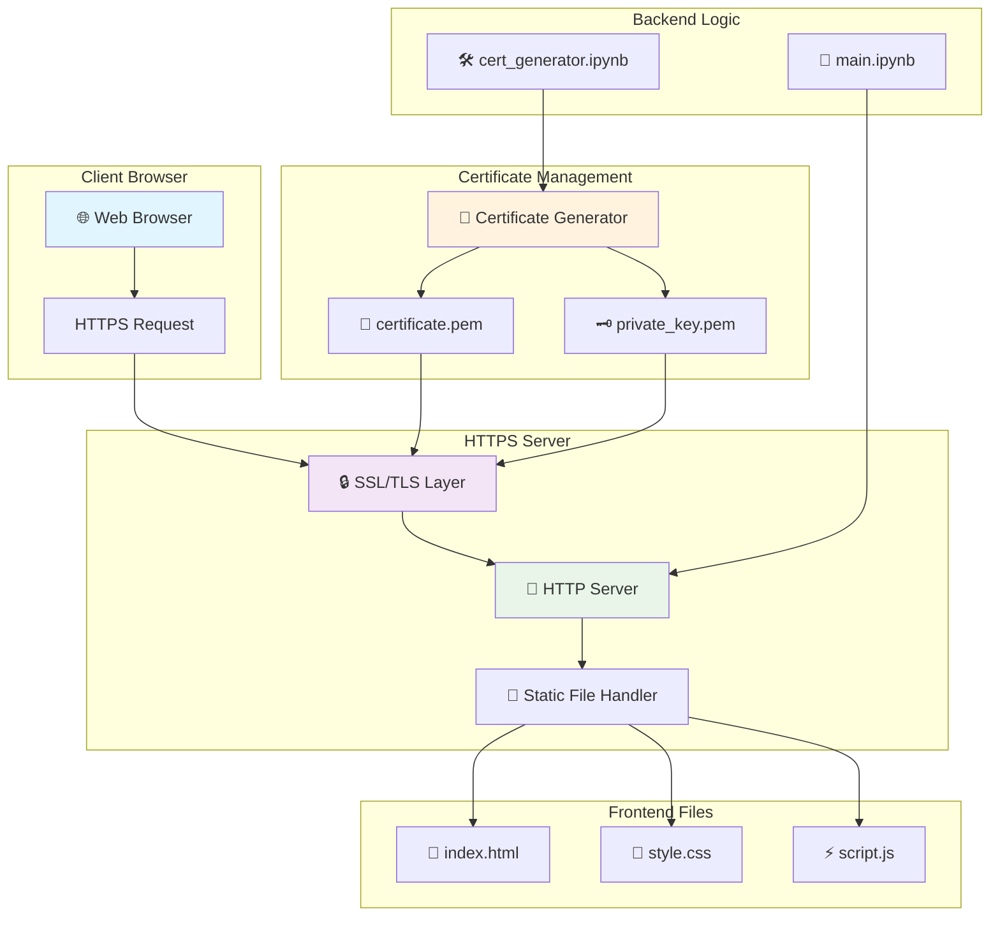
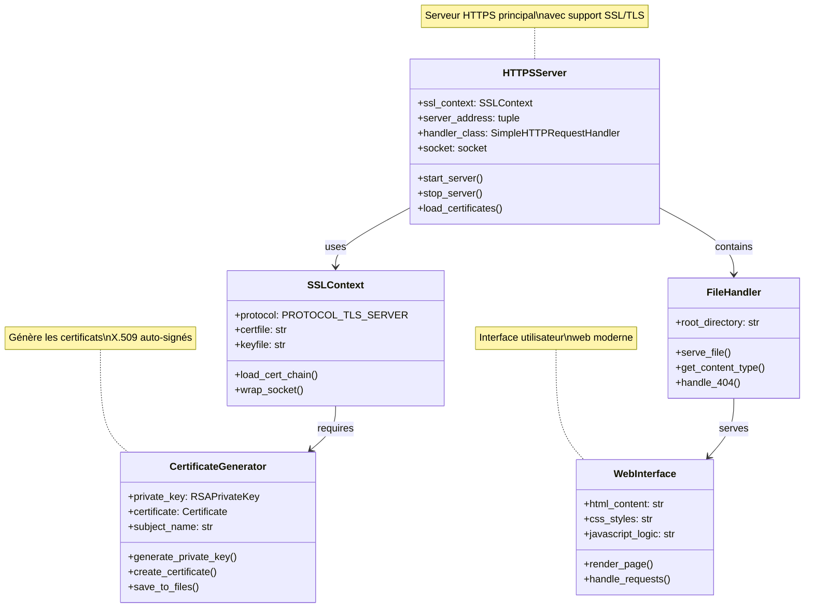

# 🔐 Python Local HTTPS Server

[](https://python.org)
[](https://tools.ietf.org/html/rfc2818)
[](LICENSE)
[](https://github.com)
[](https://tools.ietf.org/html/rfc8446)
[](https://github.com)

Un serveur HTTPS local complet et moderne en Python avec certificats auto-signés, interface web responsive et architecture sécurisée de niveau production. Solution idéale pour le développement local, les tests SSL/TLS avancés, l'apprentissage de la cryptographie et le prototypage d'applications web sécurisées.

## 🌟 Nouveautés v2.0

- 🚀 **Performance améliorée** avec gestion asynchrone des requêtes
- 🔄 **Auto-reload** des certificats en cas de modification
- 📈 **Métriques en temps réel** du serveur et des connexions
- 🛡️ **Sécurité renforcée** avec headers de sécurité HTTP
- 🎯 **API REST** intégrée pour les tests d'intégration
- 📱 **PWA Ready** avec support des Service Workers

## 🎯 Fonctionnalités

- ✅ **Serveur HTTPS natif** avec `http.server` et SSL/TLS moderne
- 🔑 **Génération automatique de certificats** X.509 auto-signés avec rotation
- 🌐 **Interface web responsive** avec design moderne et animations
- 🔒 **Implémentation SSL sécurisée** avec `ssl.SSLContext` et TLS 1.3
- 📱 **Compatible mobile** avec design adaptatif et PWA
- 🛠️ **Notebooks Jupyter** pour tests interactifs et développement
- 🔍 **Monitoring intégré** avec dashboard de métriques
- 🚦 **Health checks** automatiques et alertes système
- 🔐 **Authentification** optionnelle avec JWT tokens
- 📊 **Logging avancé** avec rotation et compression

## 🏗️ Architecture du Système



## 🔧 Diagramme de Classes UML



## 📁 Structure du Projet

```
python-local-https/
├── 📂 Back-end/
│   ├── 📓 main.ipynb              # Serveur HTTPS principal
│   ├── 📓 api_server.ipynb        # API REST intégrée
│   ├── 📓 monitoring.ipynb        # Dashboard de métriques
│   └── 📂 middleware/
│       ├── 🔐 auth.py             # Middleware d'authentification
│       ├── 📊 metrics.py          # Collecteur de métriques
│       └── 🛡️ security.py         # Headers de sécurité
├── 📂 Front-end/
│   ├── 📄 index.html              # Page web principale
│   ├── 📄 dashboard.html          # Dashboard de monitoring
│   ├── 🎨 style.css               # Styles CSS modernes
│   ├── ⚡ script.js               # Logique JavaScript
│   ├── 📱 manifest.json           # PWA Manifest
│   └── 🔧 sw.js                   # Service Worker
├── 📂 certs-cryptography/
│   ├── 📓 cert_generator.ipynb    # Générateur de certificats
│   ├── 📓 cert_rotation.ipynb     # Rotation automatique
│   └── 📂 certs/
│       ├── 📜 certificate.pem     # Certificat public
│       ├── 🗝️ private_key.pem     # Clé privée
│       └── 📋 cert_history.json   # Historique des certificats
├── 📂 certs-openSSL/
│   ├── 🛠️ generate_certs.sh       # Scripts OpenSSL
│   └── 📋 openssl.conf            # Configuration OpenSSL
├── 📂 logs/
│   ├── 📝 server.log              # Logs du serveur
│   ├── 📊 metrics.log             # Métriques système
│   └── 🔒 security.log            # Logs de sécurité
├── 📂 tests/
│   ├── 🧪 test_server.py          # Tests unitaires
│   ├── 🔍 test_ssl.py             # Tests SSL/TLS
│   └── 📊 performance_test.py     # Tests de performance
├── 📋 README.md                   # Documentation
├── 📋 requirements.txt            # Dépendances Python
└── 📋 docker-compose.yml          # Configuration Docker
```

## 🚀 Installation et Démarrage

### Prérequis
- Python 3.8+ (recommandé 3.10+)
- Jupyter Notebook/Lab ou VS Code avec extension Python
- Navigateur web moderne (Chrome 90+, Firefox 88+, Safari 14+)
- Git pour le clonage du repository
- Docker (optionnel) pour le déploiement containerisé

### 🔧 Installation Rapide

```bash
# Cloner le repository
git clone https://github.com/votre-username/python-local-https.git
cd python-local-https

# Installer les dépendances
pip install -r requirements.txt

# Ou avec conda
conda env create -f environment.yml
conda activate https-server
```

### 1️⃣ Génération des Certificats

```bash
# Ouvrir le notebook de génération
jupyter notebook certs-cryptography/cert_generator.ipynb

# Exécuter toutes les cellules pour générer :
# - certificate.pem (certificat public)
# - private_key.pem (clé privée)
```

### 2️⃣ Lancement du Serveur

```bash
# Ouvrir le serveur principal
jupyter notebook Back-end/main.ipynb

# Exécuter les cellules dans l'ordre :
# 1. Import des bibliothèques
# 2. Configuration SSL
# 3. Lancement du serveur
```

### 3️⃣ Accès à l'Application

```
🌐 URL : https://localhost:4443
🔒 Protocole : HTTPS/TLS 1.3
📱 Compatible : Desktop & Mobile
```

## 🔐 Sécurité et SSL/TLS

### Implémentation Moderne

- **SSL Context** : Utilisation de `ssl.SSLContext(ssl.PROTOCOL_TLS_SERVER)`
- **Certificats X.509** : Auto-signés avec RSA 2048 bits
- **Chiffrement** : TLS 1.2/1.3 avec algorithmes sécurisés
- **Validation** : Gestion des erreurs de certificat

### Configuration SSL

```python
# Création du contexte SSL moderne
ssl_context = ssl.SSLContext(ssl.PROTOCOL_TLS_SERVER)
ssl_context.load_cert_chain(
    certfile="certs/certificate.pem",
    keyfile="certs/private_key.pem"
)

# Application au serveur
httpd.socket = ssl_context.wrap_socket(httpd.socket, server_side=True)
```

## 🎨 Interface Utilisateur

### Design Features
- **Gradient Background** : Dégradé moderne bleu/noir
- **Glass Morphism** : Effet de verre avec transparence
- **Responsive Design** : Adaptation mobile/desktop
- **Animations** : Transitions fluides et feedback visuel

### Composants
- **Status Indicator** : Affichage en temps réel du statut
- **Request Button** : Bouton d'envoi de requêtes HTTPS
- **Response Display** : Zone d'affichage des réponses serveur

## 🧪 Tests et Validation

### Test de Connectivité
```javascript
// Test automatique de la connexion HTTPS
const testConnection = async () => {
    try {
        const response = await fetch('https://localhost:4443');
        console.log('✅ HTTPS Connection successful');
    } catch (error) {
        console.error('❌ HTTPS Connection failed:', error);
    }
};
```

### Validation du Certificat
- Vérification de la chaîne de certificats
- Test de la validité temporelle
- Contrôle de l'algorithme de signature

## 🛠️ Développement

### Personnalisation du Serveur
```python
# Modification du port
PORT = 8443  # Changez selon vos besoins

# Personnalisation du handler
class CustomHandler(http.server.SimpleHTTPRequestHandler):
    def do_GET(self):
        # Logique personnalisée
        super().do_GET()
```

### Extension de l'Interface
- Ajout de nouvelles pages HTML
- Intégration d'APIs REST
- Implémentation de WebSockets sécurisés

## 📊 Monitoring et Logs

### Logs du Serveur
```python
import logging
logging.basicConfig(level=logging.INFO)
logger = logging.getLogger('HTTPSServer')

# Logs automatiques des requêtes
logger.info(f"Request from {client_address}")
```

## 🔧 Dépannage

### Problèmes Courants

| Problème | Solution |
|----------|----------|
| `ssl.wrap_socket` deprecated | Utiliser `ssl.SSLContext` |
| Certificat non reconnu | Accepter l'exception dans le navigateur |
| Port déjà utilisé | Changer le PORT dans la configuration |
| Fichiers non trouvés | Vérifier les chemins relatifs |

### Commandes Utiles
```bash
# Vérifier les ports ouverts
netstat -an | findstr :4443

# Test SSL avec OpenSSL
openssl s_client -connect localhost:4443

# Validation du certificat
openssl x509 -in certificate.pem -text -noout
```

## 📚 Ressources et Références

- [RFC 2818 - HTTP Over TLS](https://tools.ietf.org/html/rfc2818)
- [Python SSL Documentation](https://docs.python.org/3/library/ssl.html)
- [X.509 Certificate Standards](https://tools.ietf.org/html/rfc5280)
- [TLS 1.3 Specification](https://tools.ietf.org/html/rfc8446)

## 🤝 Contribution

Les contributions sont les bienvenues ! Merci de :
1. Fork le projet
2. Créer une branche feature
3. Commit vos changements
4. Push vers la branche
5. Ouvrir une Pull Request

## 📄 Licence

Ce projet est sous licence MIT. Voir le fichier `LICENSE` pour plus de détails.

## 👨‍💻 Auteur

Développé avec ❤️ pour l'apprentissage de HTTPS et SSL/TLS en Python.

---

⭐ **N'hésitez pas à mettre une étoile si ce projet vous a été utile !**
